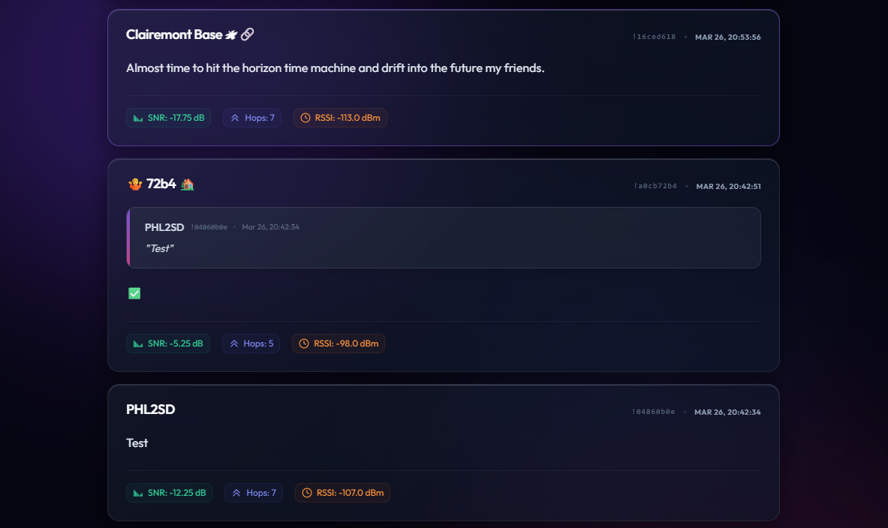

# MeshMonitor Chat Feed

A web-based real-time chat feed (think Twitter/X) for Meshtastic nodes running [MeshMonitor](https://github.com/Yeraze/meshmonitor).

## Features
- Modern dark theme with heavy glassmorphism design and animated ambient lighting.
- Real-time, perfectly smooth updates via HTMX and idiomoph DOM morphing.
- Threaded message grouping (Twitter-style quotes) automatically resolving `replyId` parents.
- Mobile-responsive layout.
- Visual `MQTT` badge indicators for bridged messages.
- Signal metrics (SNR, RSSI, Hops) visualized beautifully across messages.

## 🚀 Quick Start (Docker Compose)

The fastest way to get MeshMonitor Chat Feed running is using Docker Compose.

1.  **Download the configuration files**:
    ```bash
    curl -O https://raw.githubusercontent.com/jonrick/meshmonitor_chatfeed/main/docker-compose.yml
    curl -O https://raw.githubusercontent.com/jonrick/meshmonitor_chatfeed/main/.env.example
    cp .env.example .env
    ```

2.  **Configure `.env`**:
    Edit the `.env` file and add your `MESH_MONITOR_API_BASE_URL` and `MESH_MONITOR_API_TOKEN`.

3.  **Deploy**:
    ```bash
    docker compose up -d
    ```
    The application will be available at `http://localhost:8000`.

---

## 🛠️ Configuration

| Variable | Description | Default |
| :--- | :--- | :--- |
| `MESH_MONITOR_API_BASE_URL` | **(Required)** The URL of your MeshMonitor API instance | - |
| `MESH_MONITOR_API_TOKEN` | **(Required)** Your API Bearer token (`mm_v1_...`) | - |
| `POLL_INTERVAL_SECONDS` | How often to refresh the feed in seconds | `10` |
| `MESSAGE_LIMIT` | Number of initial messages to load | `50` |
| `PAGE_TITLE` | Top header primary text | `MeshMonitor` |
| `PAGE_SUBTITLE` | Subtitle text (leave empty to hide) | `Real-time Chat Feed` |

## 💻 Manual Setup (Local Development)

1.  **Clone and install dependencies**:
    ```bash
    git clone https://github.com/jonrick/meshmonitor_chatfeed.git
    cd meshmonitor_chatfeed
    python -m venv venv
    .\venv\Scripts\Activate.ps1 # Windows
    # source venv/bin/activate # Linux/Mac
    pip install -r requirements.txt
    ```

2.  **Run the application**:
    ```bash
    python main.py
    ```

## 🐋 Manual Docker Deployment

If you prefer to build and run the image manually:

```bash
docker build -t meshmonitor_chatfeed .
docker run -d -p 8000:8000 --env-file .env meshmonitor_chatfeed
```

